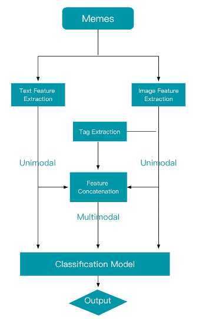
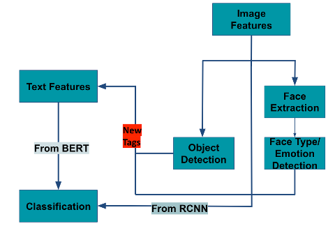
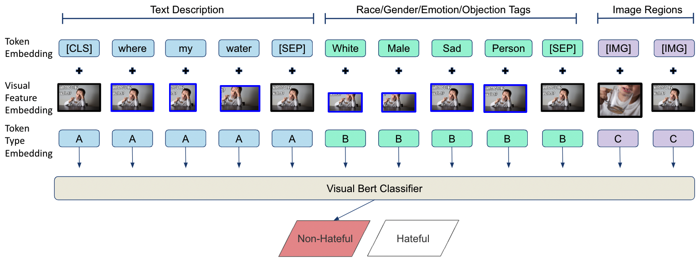
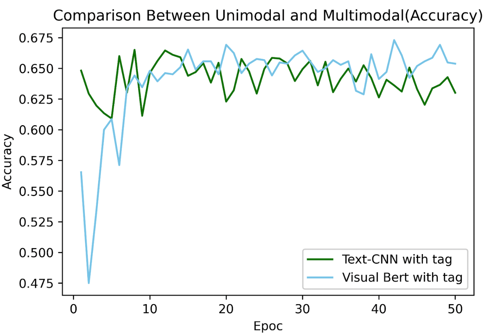
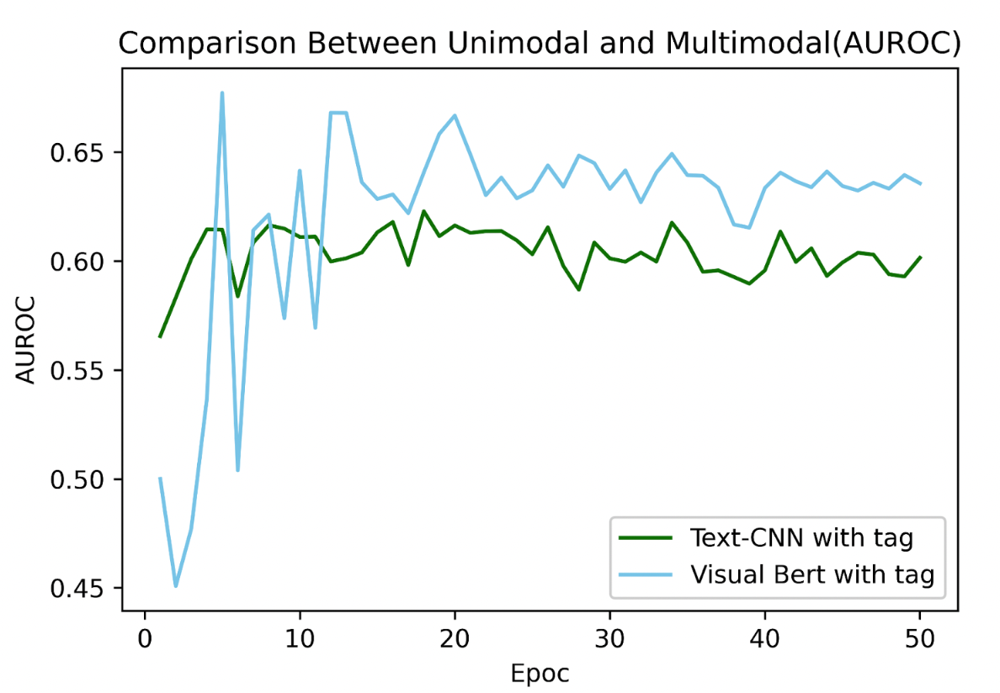

# Multimodal Deep Learning-based Project: Hateful Meme Detection

**by Ruitian Wu, Yijia Xue**

*names by the alphabetical order of the last names*

## Introduction

##### Background Information & Motivation

Hate speeches are regrettably omnipresent today. Hate speech exists not only in offline communication but also in online communication. Because of the anonymous nature of communication in virtual worlds, people feel less responsible for what they say and express more hurtful things.

In today’s social media, however, text is not the only format for voicing ideas publicly. Nowadays, one most popular format that is employed by people, especially the younger generation, is the meme, which poses an interesting multimodal fusion of both image and speech. Originally, memes are meant to express some ideas in a humorous or implicit way. The meaning expressed by memes could be so concise or even excellent that people love to use it anywhere. However, it could also be used to show irony or even hatred towards others, which might make it harmful. 

Unlike simple hate speech which could be detected with some certain Natural Language Processing methodologies, hate memes are hard to be captured. For example, both the image and the speech might be innocuous when we view them individually. However, if we combine them together, they could mean something ironic and thus harmful. For example, if we gave a speech “Look how many people love you” and an image of a dessert, neither of them seems to be harmful. However, if we combine them together, this could be sarcasm indicating that there are no people loving you at all, which is quite offensive.

**Characteristics for the method**

We divided our project into constructing three types of models: text-based model, image-based model, and multimodal model. The main architecture of the project is shown in below Figure.

According to the flow chart, our project is mainly divided into 5 steps: 

​			I. Extract text features and implement text-based model

​			II. Extract image features and implement image-based model

​			III. Extract tag with hate-related information 

​			IV. Concatenate three channel’s input 

​			V. Implement the final classification model

## Implemented Model 

The structure of the multimodal model is shown below:

There is one indispensable step in the construction of the final multimodal model: to derive the hate-related tags from the image. Since one type of the hateful meme refers to direct or indirect attack on people based on characteristics. Then we want to extract human’s characteristics such as gender, race, and emotion from the meme. 

The task of extracting information from human is divided into 2 steps:

1. Labeling images that contain human faces
2. Extract characteristics information from the labeling images 

Moreover, the definition of hateful meme also mentions dehumanizing information. We then implemented an object detection model to detect what objects exist in the meme. The purpose of this procedure is to find the internal relation between the meme scene and the dehumanizing information. 

**Remark:** for reading comfort, the details of the model are introduced in the **Project Report.doc**

We implemented Visual-BERT with 2 types of input set: [text, image], [text, tag, image]. Comparing the performance of the model with these two input sets, we can validate the feasibility of the tag extraction procedure in our proposed model.

We use ‘bert-base-uncased’ data tokenizer which was introduced in the milestone report 2 to do the text tokenization and use the pretrained ‘vit-base-patch16-224-in21k’ model to extract vision features. We use the pre-trained Visual-BERT model ‘uclanlp/visualbert-nlvr2-coco-pre’ as the base model for the finetuning process.

In the model finetuning process, we train the model 50 epochs with batch size 24. In the training process, we set the weight decay (add a penalty term to weights and bias) into 0.01 and set the learning rate at 2*10^-5 . For every 250 steps, we record the training loss, validation loss, accuracy and auroc score.

## **Performance Evaluation**

| Model                    | Accuracy | Recall | Precision | F1    |
| ------------------------ | -------- | ------ | --------- | ----- |
| TF-IDF + LR              | 61.8%    | 18.2%  | 63.3%     | 0.28  |
| TF-IDF + SVM             | 61.3%    | 16.8%  | 61.6%     | 0.26  |
| TF-IDF + NB              | 60.0%    | 13.2%  | 57.1%     | 0.21  |
| TF-IDF + RF              | 58.7%    | 0.1%   | 100.0%    | 0.02  |
| TF-IDF + KNN             | 58.7%    | 57.1%  | 0.3%      | 0.001 |
| BERT                     | 58.3%    | 35.5%  | 63.6%     | 0.46  |
| Text-CNN                 | 63.1%    | 45.7%  | 50.4%     | 0.48  |
| ResNet                   | 64.5%    | 0%     | 64.5%     | 0     |
| Visual  BERT             | 58.1%    | 42.2%  | 50.3%     | 0.46  |
| Visual  BERT  with  tags | 67.3%    | 58.8%  | 66.0%     | 0.62  |

To compare the results more intuitively between the proposed final model and unimodal model with the best performance. Accuracy and AUROC versus epoch number is plotted in below Figure. We can see from the results, as the number of epochs increases, the performance of the proposed final model stably outperforms that of the unimodal model.

## Readme for Code

**The following texts introduce the purpose of each notebook.**
*TF_IDF.ipynb This code implemented the TF-IDF based model(text unimodal) with different ML-based classifier
*TextCNN.ipynb This notebook implemented the Text-CNN based(text unimodal), with some exploratory data analysis 
*ResNet.ipynb implemented Resnet50 based(image unimodal) model
*BERT_Model.ipynb implemented the Bert-based(text unimodal) classification model
*Face Detection.ipynb implemented Haar Cascade Classifier model to detect the most important face in the image
*Object Detection.ipynb implemented the YOLOv5 model to detect the object in the image
*VisualBERT.ipynb implemented the final classification model based on Visual BERT with three channels input

**Essential Guidance before running the notebooks:**

1. Change the data loading path to your own data loading path
2. Follow the code to install necessary python library
3. For text-based model, you need to read the json file under the hateful_memes folder
   For image-based model, you need to download the meme image from the link to google drive
   For the final classification model, there are three channels' input, first you will use only text       	       	        
   And Image input to get the baseline model result. 
   Then, you need use 'new_merged.csv' to get three channel's input and implemented the final classification    
   model to get our final model's result.
4. If you use ImageFolder to read the image， you need first to create two folders to store all the image. Then you can run it.
5.### Link to google drive which contains the meme image
https://drive.google.com/file/d/1ohViVHFKOI3b8VAEt018aPER6V0coEhH/view?usp=sharing

